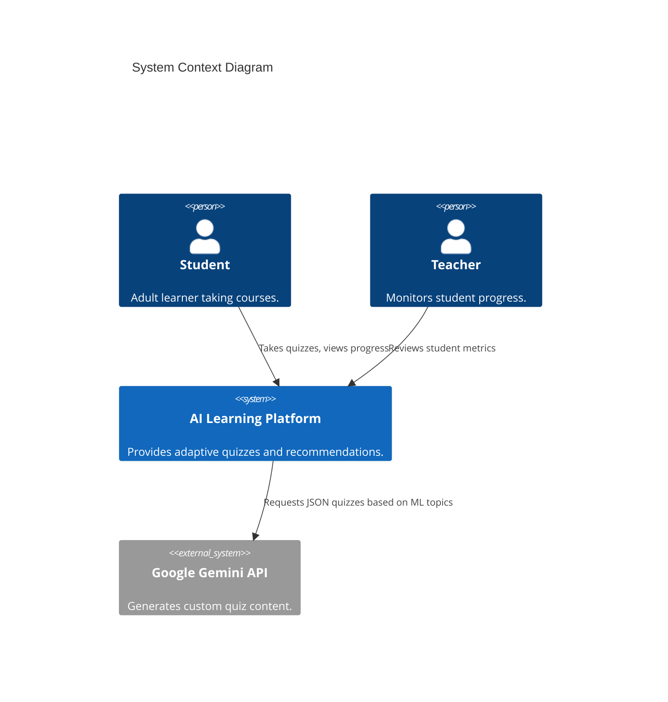
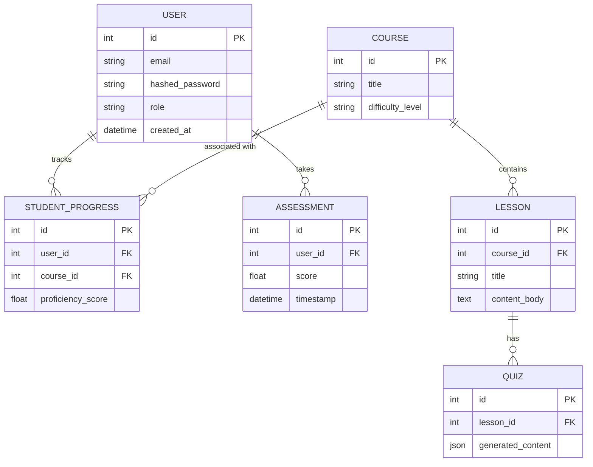
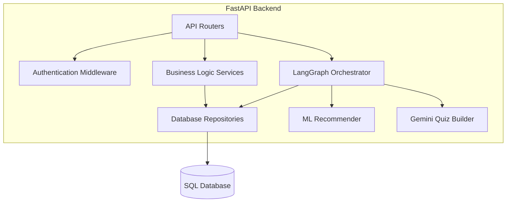
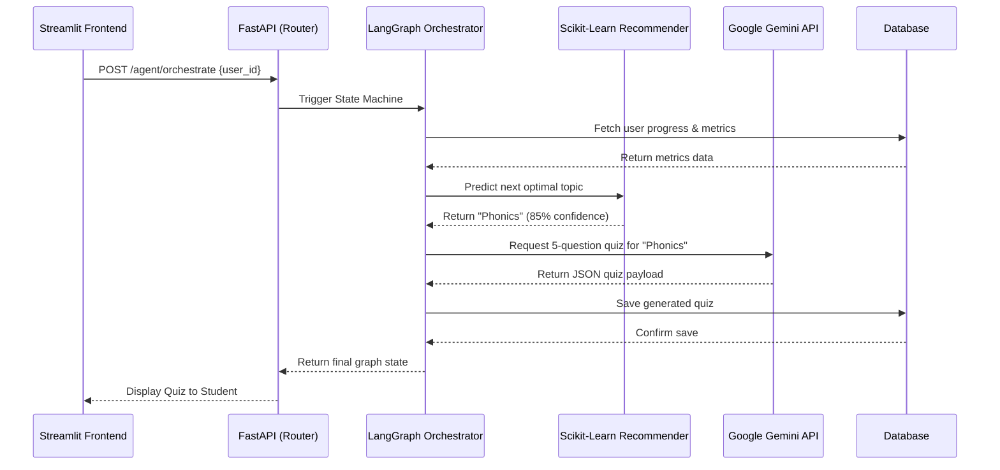
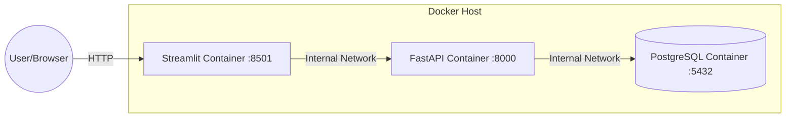

# Comprehensive System Architecture & Low-Level Design (LLD)
**Project:** AI-Powered Personalized Learning Platform (Adult Literacy and Basic Education)

---

## 1. Requirement Analysis

### 1.1 Core Objectives
*   **Adaptive Learning:** Dynamically recommend topics based on student performance using Machine Learning (Scikit-Learn).
*   **Dynamic Content Generation:** Create contextual, tailored multiple-choice quizzes on the fly using Generative AI (Google Gemini).
*   **NLP Evaluation:** Evaluate student responses for sentiment, reading level, and misconceptions (Hugging Face Transformers/spaCy).
*   **Autonomous Orchestration:** Seamlessly string together ML, GenAI, and Database states without human intervention (LangGraph).

### 1.2 Functional Requirements
*   **Authentication:** Secure registration, login, and Role-Based Access Control (Student, Teacher, Admin).
*   **Assessment System:** Initial baseline testing and continuous progress tracking.
*   **Dashboard:** Intuitive user interface for students to view metrics, take quizzes, and see recommendations.

### 1.3 Non-Functional Requirements
*   **Scalability:** Microservice-ready backend via FastAPI and Docker.
*   **Security:** JWT-based stateless authentication, bcrypt password hashing, and secure API boundaries.
*   **Performance:** Fast API response times and asynchronous model inference.

---

## 2. System Architecture

The platform utilizes a multi-tier, client-server architecture with an integrated AI orchestrator. 
*   **Presentation Tier:** Streamlit (Python)
*   **Application Tier:** FastAPI (RESTful API, Auth, Business Logic)
*   **Data Tier:** PostgreSQL / SQLite
*   **AI Engine Tier:** LangGraph (State Machine), Gemini (GenAI), Scikit-Learn (ML), Transformers (NLP)

---

## 3. C4 Model

### 3.1 System Context Diagram (Level 1)


### 3.2 Container Diagram (Level 2)
```mermaid
C4Container
    title Container Diagram
    Person(user, "User", "Student or Teacher")
    
    Container(frontend, "Streamlit Dashboard", "Python", "Provides the UI.")
    Container(backend, "FastAPI Application", "Python", "Handles business logic, auth, and AI orchestration.")
    ContainerDb(database, "PostgreSQL Database", "Relational DB", "Stores users, courses, and progress metrics.")
    Container(ml_models, "Scikit-Learn Models", "Pickle/PKL", "Predicts optimal learning paths.")
    Container(nlp_pipeline, "Hugging Face Transformers", "Python", "Analyzes sentiment and reading levels.")
    
    Rel(user, frontend, "Interacts via HTTPS")
    Rel(frontend, backend, "REST API Calls (JSON)")
    Rel(backend, database, "Reads/Writes (SQLAlchemy ORM)")
    Rel(backend, ml_models, "Loads for inference")
    Rel(backend, nlp_pipeline, "Processes text inputs")
    Rel(backend, "Google Gemini", "API request (gRPC/REST)")
```

---

## 4. UML Diagrams

### 4.1 Use Case Diagram
```mermaid
usecaseDiagram
    actor Student
    actor Teacher
    
    Student --> (Register/Login)
    Student --> (Take Baseline Assessment)
    Student --> (View Recommended Topic)
    Student --> (Take AI-Generated Quiz)
    
    Teacher --> (Register/Login)
    Teacher --> (View Student Analytics)
    Teacher --> (Manage Course Content)
```

---

## 5. ER Diagram & Database Schema

### 5.1 Entity-Relationship (ER) Diagram


### 5.2 Database Design Details
*   **ORM:** SQLAlchemy
*   **Migrations:** Alembic
*   **Keys:** Strict foreign-key constraints linking Users to their Progress and Assessments to ensure data integrity.

---

## 6. Component Diagram

Illustrates the internal structure of the FastAPI backend.



---

## 7. Sequence Diagram

This outlines the core autonomous AI loop when a student requests the next lesson.



---

## 8. API Design & Documentation

The API follows strict RESTful conventions using FastAPI. OpenAPI/Swagger documentation is auto-generated at `/docs`.

### 8.1 Endpoints
| Method | Endpoint | Description | Auth Required |
| :--- | :--- | :--- | :--- |
| `POST` | `/auth/register` | Creates a new User. | No |
| `POST` | `/auth/login` | Returns JWT Access Token. | No |
| `GET`  | `/users/me` | Returns current user profile. | Yes |
| `POST` | `/assessment/submit` | Grades and stores an assessment. | Yes |
| `POST` | `/agent/orchestrate` | Kicks off the LangGraph AI pipeline. | Yes |

### 8.2 Standard Response Model (JSON)
```json
{
  "status": "success",
  "data": { ... },
  "message": "Operation completed successfully."
}
```

---

## 9. Security Design

### 9.1 Authentication & Authorization
*   **Stateless Sessions:** JWT (JSON Web Tokens) with a 30-minute expiration.
*   **Password Security:** Passwords are never stored in plaintext. Hashed via `bcrypt`.
*   **Dependency Injection:** FastAPI `Depends()` enforces that routes requiring authentication automatically validate the JWT in the `Authorization: Bearer <token>` header.

### 9.2 API Security
*   **CORS Configuration:** Strictly defined origins allowed.
*   **Environment Variables:** Secrets (`SECRET_KEY`, `GEMINI_API_KEY`, `DATABASE_URL`) are isolated in a `.env` file and never committed to version control.

---

## 10. Deployment Architecture & Plan

### 10.1 Deployment Architecture Diagram


### 10.2 Deployment Plan
1.  **Containerization:** `Dockerfile` is provided for both backend and frontend.
2.  **Orchestration:** `docker-compose.yml` links the web layer, API layer, and database layer into an isolated virtual network.
3.  **Environment Setup:** Provision a `.env` file on the production server.
4.  **Execution:** Run `docker-compose up -d --build` to pull images, build the containers, run Alembic migrations, and start the application in detached mode.
5.  **Reverse Proxy:** In a true production environment, an NGINX reverse proxy would sit in front of the Docker Host to handle SSL/TLS termination and route traffic to ports 8000/8501.
